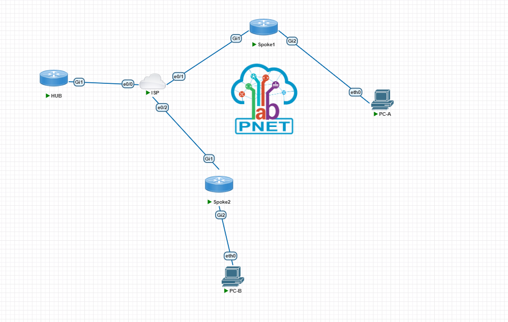
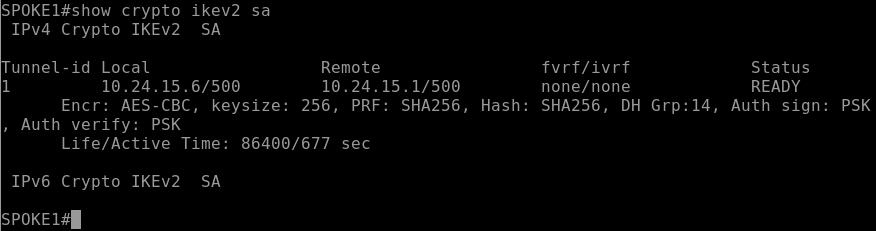
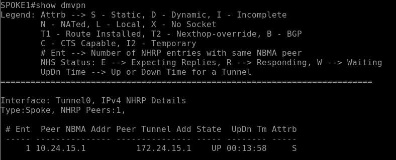
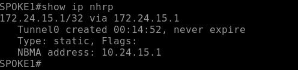
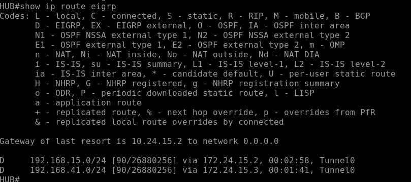
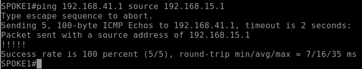

# VPN Hub and Spoke DMVPN Fase 3 IKEv2

**Estudiante:** Edwin De Paula  
**Matricula:** 2024-2415  
**Institución:** Instituto Tecnológico de las Américas (ITLA)  
**Asignatura:** Seguridad en Redes

---

## Video

| Recurso | URL |
|---|---|
| Video YouTube | https://youtu.be/1cjMgvpB0qU |

---

## Objetivo

Implementar una VPN hub and spoke punto a multipunto utilizando DMVPN Fase 3 con IKEv2, estableciendo un túnel mGRE multipunto cifrado entre un Hub y dos Spokes a través de un router ISP, con enrutamiento dinámico EIGRP. Fase 3 mejora sobre Fase 2 mediante un mecanismo de reenvío NHRP más inteligente (`ip nhrp redirect` en el Hub y `ip nhrp shortcut` en los Spokes), permitiendo resumir rutas en el Hub sin perder la capacidad de comunicación directa spoke-to-spoke, haciendo la solución más escalable para redes grandes.

---

## Topología



| Dispositivo | Interfaz | Dirección IP | Descripción |
|---|---|---|---|
| HUB | GigabitEthernet1 | 10.24.15.1/30 | WAN hacia ISP |
| HUB | Tunnel0 | 172.24.15.1/24 | mGRE DMVPN |
| ISP | Ethernet0/0 | 10.24.15.2/30 | WAN hacia HUB |
| ISP | Ethernet0/1 | 10.24.15.5/30 | WAN hacia SPOKE1 |
| ISP | Ethernet0/2 | 10.24.15.9/30 | WAN hacia SPOKE2 |
| SPOKE1 | GigabitEthernet1 | 10.24.15.6/30 | WAN hacia ISP |
| SPOKE1 | GigabitEthernet2 | 192.168.15.1/24 | LAN Site B |
| SPOKE1 | Tunnel0 | 172.24.15.2/24 | mGRE DMVPN |
| SPOKE2 | GigabitEthernet1 | 10.24.15.10/30 | WAN hacia ISP |
| SPOKE2 | GigabitEthernet2 | 192.168.41.1/24 | LAN Site C |
| SPOKE2 | Tunnel0 | 172.24.15.3/24 | mGRE DMVPN |
| PC-A | eth0 | 192.168.15.10/24 | Gateway: 192.168.15.1 |
| PC-B | eth0 | 192.168.41.10/24 | Gateway: 192.168.41.1 |

---

## Parámetros de Configuración

### IKEv2 Proposal, Policy, Keyring y Profile

| Parámetro | Valor |
|---|---|
| Proposal | PROP-2415 |
| Cifrado | AES-CBC-256 |
| Integridad | SHA-256 |
| Grupo Diffie-Hellman | Grupo 14 (2048 bits) |
| Policy | POL-2415 |
| Keyring | KR-2415 |
| Pre-shared Key | Edwin2024 |
| Profile | IKEV2-PROF-2415 |

### Fase 2 - IPSec

| Parámetro | Valor |
|---|---|
| Transform Set | TS-2415 |
| Protocolo | ESP |
| Cifrado | AES 256 |
| Integridad | SHA-256 HMAC |
| Modo | Transport |
| IPSec Profile | PROF-2415 |
| IKEv2 Profile en PROF-2415 | IKEV2-PROF-2415 |

### NHRP y Tunnel0 (mGRE) — Fase 3

| Parámetro | Valor |
|---|---|
| Network ID | 2415 |
| Autenticación | Edwin2024 |
| Redirect (HUB) | `ip nhrp redirect` |
| Shortcut (Spokes) | `ip nhrp shortcut` |
| IP HUB | 172.24.15.1/24 |
| IP SPOKE1 | 172.24.15.2/24 |
| IP SPOKE2 | 172.24.15.3/24 |

### EIGRP

| Parámetro | Valor |
|---|---|
| AS Number | 2415 |
| Redes anunciadas (HUB) | 172.24.15.0/24 |
| Redes anunciadas (SPOKE1) | 172.24.15.0/24, 192.168.15.0/24 |
| Redes anunciadas (SPOKE2) | 172.24.15.0/24, 192.168.41.0/24 |
| Split-horizon | Deshabilitado en HUB |

---

## Explicación de la Configuración

### Diferencia entre DMVPN Fase 2 y Fase 3

En Fase 2 (Lab 7), los Spokes podían comunicarse directamente entre sí, pero cada Spoke necesitaba conocer rutas específicas hacia las redes remotas — sin posibilidad de resumir rutas en el Hub sin perder la comunicación spoke-to-spoke. Fase 3 introduce un mecanismo de redirección NHRP más inteligente:

| Aspecto | Fase 2 | Fase 3 |
|---|---|---|
| Comando en el Hub | Ninguno adicional | `ip nhrp redirect` |
| Comando en los Spokes | Ninguno adicional | `ip nhrp shortcut` |
| Resumen de rutas en el Hub | No es posible sin romper spoke-to-spoke | Sí es posible |
| Escalabilidad | Limitada | Mejorada para redes grandes |
| Protocolo de negociación | IKEv1 | IKEv2 |

### ¿Cómo funciona `ip nhrp redirect` y `ip nhrp shortcut`?

Cuando el Hub recibe tráfico de un Spoke destinado a otro Spoke, en lugar de simplemente reenviarlo (como en Fase 2), el Hub envía un mensaje NHRP redirect al Spoke origen, indicándole que existe una ruta más corta directamente hacia el Spoke destino. El Spoke origen, al recibir este redirect, instala una entrada NHRP shortcut en su tabla, permitiendo el envío directo de tráfico subsecuente sin pasar por el Hub.

### Diferencia de configuración IKEv1 vs IKEv2 (igual que en labs anteriores)

La capa IKEv2 reemplaza completamente `crypto isakmp` con los objetos `crypto ikev2 proposal/policy/keyring/profile`, y el IPSec profile referencia el IKEv2 profile con `set ikev2-profile`.

### Flujo de Negociación

1. HUB y cada Spoke negocian IKEv2 sobre sus túneles mGRE individuales
2. Cada Spoke se registra ante el Hub vía NHRP usando `ip nhrp nhs`
3. EIGRP forma vecindad y propaga rutas entre Hub y Spokes
4. SPOKE1 envía tráfico hacia la LAN de SPOKE2, inicialmente a través del Hub
5. El Hub detecta que existe una ruta más corta y envía un NHRP redirect a SPOKE1
6. SPOKE1 instala una entrada shortcut y, en comunicaciones subsecuentes, envía tráfico directamente a SPOKE2

---

## Verificación

### IKEv2 SA

```
show crypto ikev2 sa
```



Estado `READY` con AES-CBC-256, SHA256, grupo DH 14 y autenticación PSK confirmados.

### DMVPN

```
show dmvpn
```



El peer del Hub aparece en estado `UP` con la dirección NBMA correctamente resuelta.

### NHRP

```
show ip nhrp
```



Confirma la entrada NHRP estática hacia el Hub.

### EIGRP Routes

```
show ip route eigrp
```



El Hub aprende las rutas LAN de ambos Spokes vía Tunnel0.

### Prueba de Conectividad

```
ping 192.168.41.1 source 192.168.15.1
```



100% de success rate confirma la comunicación cifrada end-to-end entre las LANs de SPOKE1 y SPOKE2 a través de la topología DMVPN Fase 3 con IKEv2.

---

## Archivos del Repositorio

```
dmvpn-fase3-ikev2/
├── configs/
│   ├── HUB.txt
│   ├── ISP.txt
│   ├── SPOKE1.txt
│   └── SPOKE2.txt
├── docs/
│   └── screenshots/
│       ├── topology.png
│       ├── ikev2-sa.png
│       ├── dmvpn.png
│       ├── nhrp.png
│       ├── eigrp-routes.png
│       └── ping-test.png
└── README.md
```

---

## Herramientas Utilizadas

- PNetLab — Plataforma de emulación de red
- Cisco CSR1000v 17.03 — HUB, SPOKE1, SPOKE2
- Cisco IOSv 15.4(2)T4 — ISP
- VMware — Virtualización del servidor PNetLab
